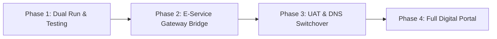

# Legacy Transition & Migration Strategy — RayongCoop Digital Portal

ยุทธศาสตร์การเปลี่ยนผ่านและเชื่อมโยงระบบเดิมโดยไม่ทำให้บริการหยุดทำงาน (Zero Downtime Migration)

---

## 1. หลักการสำคัญ (Core Principles)
- 🚫 **ห้ามลบหรือแก้ไขข้อมูลในระบบเดิมโดยตรง**
- 🛡️ **ระบบเดิมยังคงเปิดให้บริการต่อเนื่อง (Co-existence Phase)**
- 🔗 **เชื่อมโยงบริการเดิมผ่าน E-Service Gateway** ด้วยการแจ้งเตือนความปลอดภัย SweetAlert2

---

## 2. ขั้นตอนการเปลี่ยนผ่าน (Phased Migration Plan)

### 2.1 Phase 1: Dual Run & UAT Testing
- ติดตั้งระบบใหม่บน Subdomain ทดสอบ เช่น `portal.rayongcoop.com` หรือ Local / Test Server
- ให้เจ้าหน้าที่และสมาชิกกลุ่มตัวอย่างทดสอบการใช้งานระบบคำนวณเงินกู้ การดาวน์โหลดเอกสาร และการแจ้งเรื่องร้องเรียน

### 2.2 Phase 2: E-Service Gateway Configuration
- นำ URL ของระบบเดิม เช่น ระบบตรวจสอบเงินปันผล, ระบบสมาชิก, ระบบ สสธท., ระบบ กสธท. มาลงทะเบียนในโมดูล **E-Service Gateway** ใน Admin CMS
- ตั้งค่าให้แสดง SweetAlert2 ยืนยันก่อนนำผู้ใช้ไปยังหน้าเว็บเดิม เพื่อความปลอดภัยและสร้างความคุ้นเคยให้สมาชิก

### 2.3 Phase 3: Main Domain Cutover
- เมื่อผ่านการตรวจรับ (UAT) ให้สลับ DNS Record หลัก `rayongcoop.com` มาชี้ที่ RayongCoop Digital Portal ใหม่
- ระบบเดิมสามารถย้ายไปอยู่ภายใต้ Subdomain หรือ URL เส้นทางเดิมได้อย่างราบรื่น
